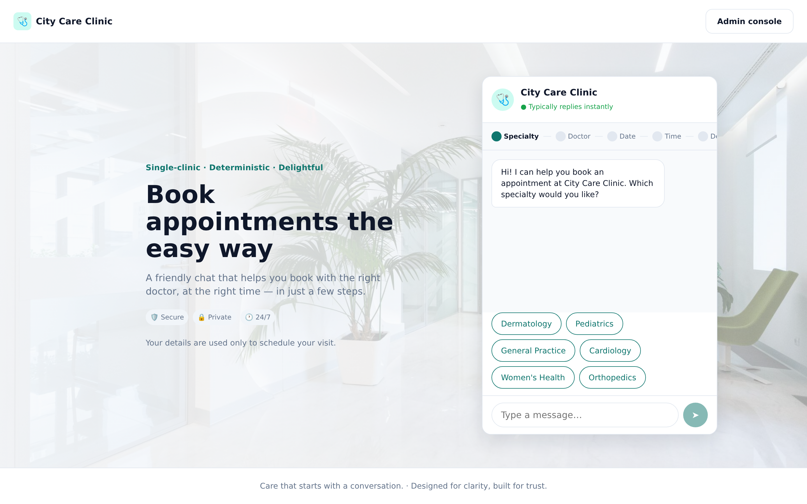
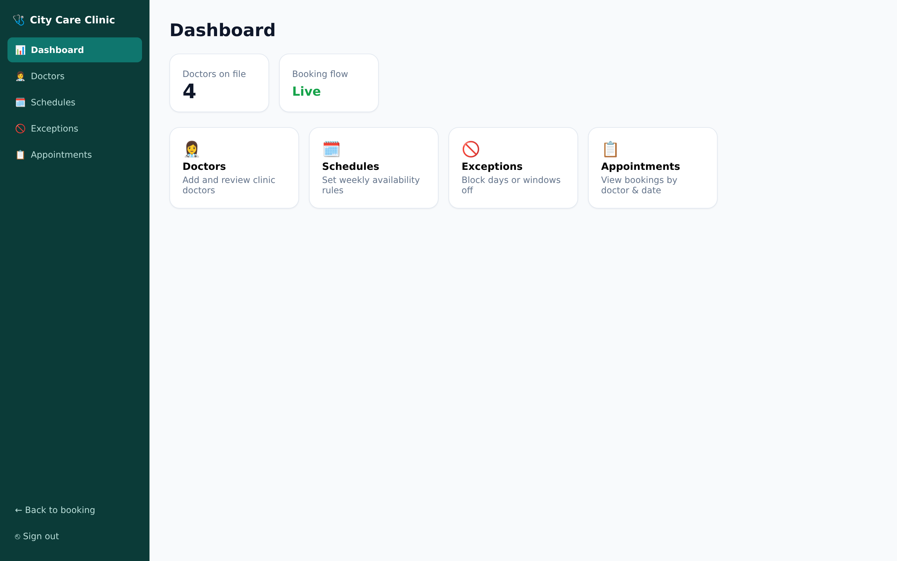
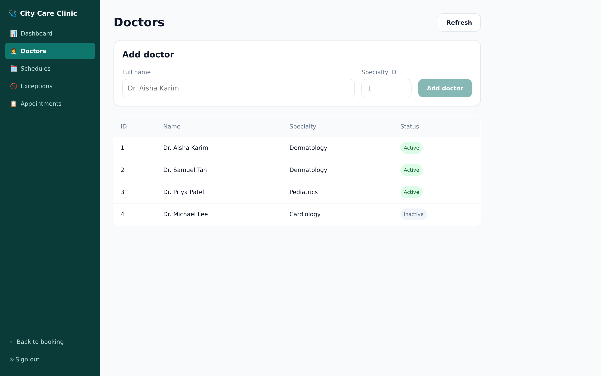
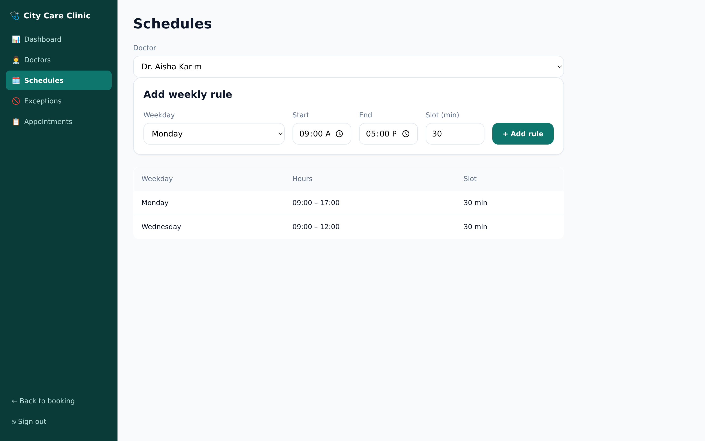

# City Care Clinic — Booking Agent

A single-clinic appointment booking app. Patients book through a friendly, **chat-driven** flow; staff manage doctors, schedules, exceptions, and appointments from an admin console.

The entire patient booking journey is driven by **one stateful endpoint** (`POST /api/chat`) — the client renders the assistant's `message` + `quickReplies` and echoes back the chosen value. Specialties, doctors, dates, and slots are never fetched separately.

- **Stack:** React 19 + Vite 8, zero routing/state dependencies
- **Design:** teal medical system (blended from the client mockups), Inter, WCAG AA
- **Surfaces:** public booking chat + token-gated admin console

---

## Screenshots

### Public booking

Hero over a real clinic photo (scrim keeps copy AA-readable), with the live chat widget: greeting, progress stepper, specialty quick-replies, and a free-text composer.



### Admin console

**Dashboard** — overview tiles and quick navigation.



**Doctors** — list and add doctors.



**Schedules** — per-doctor weekly availability rules.



> Screenshots run against a small mock backend (see [Regenerating screenshots](#regenerating-screenshots)). Point the app at the real backend to use live data.

---

## Features

### Patient booking (public)
- Full conversational flow: specialty → doctor → date → slot → name → phone → confirm → complete/cancelled.
- **Progress stepper** derived from the server `stage` — no duplicated client state.
- **Free-text input always available** beside the quick-reply chips (the API accepts either).
- **Confirmation card** built from `collectedEntities`; shows the booking reference on success.
- **Session persistence & rehydrate** — `sessionId` in `localStorage`; the transcript is restored on refresh via the history endpoint.
- **Resilient** — rate limits (`429`), network failures, and `SLOT_TAKEN` surface inline with recovery, never a crash.
- **Accessible** — `aria-live` assistant turns, focus/scroll management, 44px targets, AA contrast.

### Admin console (token-gated)
- **Dashboard** — doctor count, booking-flow status, quick nav.
- **Doctors** — list + create (`GET`/`POST /api/admin/doctors`).
- **Schedules** — per-doctor weekly rules (`GET`/`POST /api/admin/schedules`).
- **Exceptions** — block a whole day or a window (`POST /api/admin/schedule-exceptions`).
- **Appointments** — bookings by doctor + date (`GET /api/admin/bookings`).
- Admin token stored in `localStorage`, sent as `x-admin-token`. UI branches on error `code`, not message strings.

---

## Getting started

```bash
npm install
npm run dev        # http://localhost:5173, proxies /api → http://localhost:3000
```

Point at a different backend origin:

```bash
VITE_API_TARGET=http://your-backend:PORT npm run dev   # dev proxy target
# or, for a built app hitting an absolute origin:
VITE_API_BASE=https://api.example.com npm run build
```

Other scripts:

```bash
npm run build      # production build → dist/
npm run preview    # preview the production build
npm run lint       # eslint
```

---

## Architecture

Dependency-free by design — no router or state library.

| Concern | Approach |
|---|---|
| Routing | Hash router via `useSyncExternalStore` (`src/lib/router.js`); URL is the single source of truth. `#/` public, `#/admin/<section>` admin. |
| Booking state | `useChat` state machine (`src/hooks/useChat.js`) owns the conversation and talks to `POST /api/chat`. |
| API layer | `src/api/client.js` — thin `fetch` wrapper, `ApiError` carrying the domain `code`, session + admin helpers. |
| Admin reads | `useAsync` (`src/hooks/useAsync.js`) — minimal fetch hook with `AbortController` (no request leaks). |

### Project structure

```
src/
├── api/client.js               # fetch layer (chat + admin), ApiError, session
├── lib/router.js               # hash router (useSyncExternalStore)
├── hooks/
│   ├── useChat.js              # booking conversation state machine
│   └── useAsync.js             # admin fetch-state helper
├── components/chat/            # ChatWidget, ProgressStepper, MessageList,
│                               # QuickReplies, Composer, ConfirmationCard, …
├── pages/
│   ├── PublicApp.jsx           # landing hero + chat
│   └── admin/                  # AdminApp shell, Login, sections/*
└── styles/                     # tokens.css (design system) + global.css
```

---

## Design system

Blended from the client mockups (CareFlow + City Care Clinic). Tokens live in `src/styles/tokens.css`.

| Role | Value |
|---|---|
| Primary | `#0f766e` (hover `#115e59`) |
| Accent | `#0284c7` |
| Semantic | success `#16a34a` · warning `#f59e0b` · error `#dc2626` |
| Text / muted / border | `#0f172a` · `#64748b` · `#e2e8f0` |
| Surface / page | `#ffffff` · `#f8fafc` |
| Type | Inter — 28/20/17/16/14/12 scale |
| Radius | 8 / 12 / 16 / 24 / full |

Every choice was validated against UI/UX rules before implementation (WCAG AA contrast, 60-30-10, one primary action per screen, standard patterns). Responsive down to mobile — the hero stacks and the chat/tables reflow.

---

## API contract

Full contract in [`mockups/API_CONTRACT.md`](mockups/API_CONTRACT.md). Key points the frontend relies on:

- `POST /api/chat` returns `{ sessionId, stage, message, quickReplies, collectedEntities, errors }`. Send `{ message: "" }` with no `sessionId` to start.
- `GET /api/chat/:sessionId/history` rehydrates the transcript.
- `POST /api/booking/cancel` verifies by reference + phone.
- Admin endpoints require `x-admin-token`; branch on error `code` (`NOT_FOUND`, `SLOT_TAKEN`, `PHONE_MISMATCH`, `ALREADY_CANCELLED`, `INVALID_INPUT`).

---

## Regenerating screenshots

Screenshots are captured with headless Chrome (no Puppeteer dependency) driven over the DevTools Protocol, against a small zero-dep mock backend. To reproduce: run a backend on `:3000` (or the mock), `npm run dev`, launch Chrome with `--remote-debugging-port=9222`, then drive `Page.navigate` + `Page.captureScreenshot` per view. Output goes to `docs/screenshots/`.
